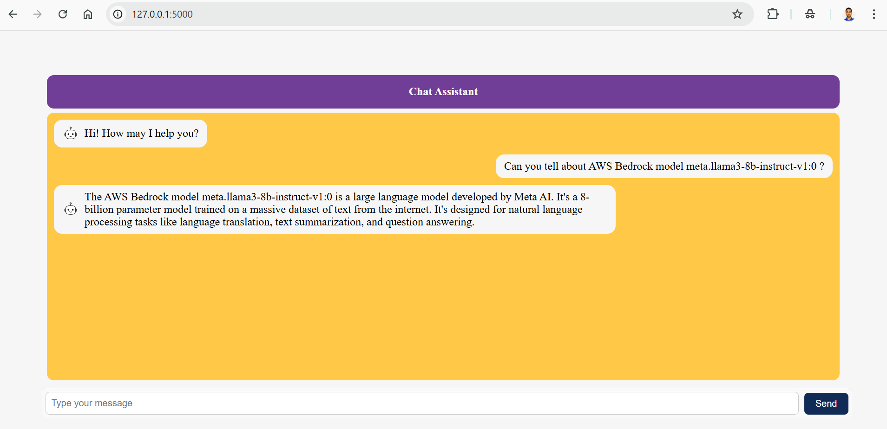

### Chatbot using Flask & AWS Bedrock hosted Llama model

This is a simple web-based chatbot built using **Flask (Python)** as the backend and **Meta’s LLaMA 3 model via AWS Bedrock** for generating AI responses. The frontend uses **HTML, CSS, and JavaScript** to deliver a clean and interactive experience.

---

### 🔧 Technologies Used

- **Backend:** Python, Flask
- **Frontend:** HTML, CSS, JavaScript
- **AI Model:**  LLaMA 3 (8B) via AWS Bedrock
- **Others:** `boto3`, `dotenv` for API key management

---

### 📸 Project Screenshot



---
### 📁 Project Structure
```
Project:.
├───static
│ ├───css
│ │ └───Chatbot_CSS.css
│ ├───js
│ │ └───script.js
│ └───chatbot_image.png
├───templates
│ └───index.html
├───app.py
├───.env
└───requirements.txt
```
---
### ⚙️ How It Works
- User inputs a message in the frontend.
- Flask receives the message and passes it to AWS Bedrock’s `ConverseStream` API.
- Meta’s LLaMA 3 generates a response based on a system prompt and user message.
- The AI response is returned and displayed on the frontend.
---
